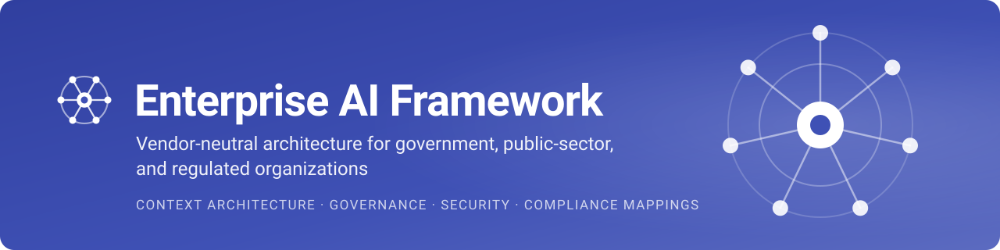

<p align="center">
  <a href="https://nishant-tamilselvan.github.io/enterprise-ai-framework/">
    
  </a>
</p>

<p align="center">
  <a href="https://github.com/nishant-tamilselvan/enterprise-ai-framework/releases/latest"></a>
  <a href="https://github.com/nishant-tamilselvan/enterprise-ai-framework/actions/workflows/docs-deploy.yml"></a>
  <a href="https://github.com/nishant-tamilselvan/enterprise-ai-framework/actions/workflows/markdown-lint.yml"></a>
  <a href="https://securityscorecards.dev/viewer/?uri=github.com/nishant-tamilselvan/enterprise-ai-framework"></a>
  <a href="LICENSE"></a>
  <a href="LICENSES/MIT.txt"></a>
</p>

<p align="center">
  <a href="https://nishant-tamilselvan.github.io/enterprise-ai-framework/"><strong>Read the framework</strong></a> ·
  <a href="#quick-start">Quick start</a> ·
  <a href="#whats-inside">What's inside</a> ·
  <a href="CONTRIBUTING.md">Contribute</a> ·
  <a href="https://github.com/nishant-tamilselvan/enterprise-ai-framework/releases">Releases</a>
</p>

The Enterprise AI Framework is an open, vendor-neutral architecture framework for responsible AI adoption in government, public-sector, and regulated organizations. It gives architects, governance leads, and delivery teams a shared language that connects mission outcomes to data, models, security, operations, and evidence.

At its center is the **Enterprise Context Architecture (ECA)**. ECA makes explicit the organizational, legal, semantic, and operational context that an AI system needs before anyone can trust it.

> [!IMPORTANT]
> Use this project for architecture guidance. Organizations remain responsible for obtaining qualified legal, regulatory, security, procurement, and compliance advice and for meeting their obligations. The compliance mappings are informative and do not certify anything.

## What's inside

| | Section | What you get |
| :---: | --- | --- |
|  | [Architecture](https://nishant-tamilselvan.github.io/enterprise-ai-framework/architecture/overview/) | Enterprise Context Architecture, its mapping to the TOGAF ADM, a capability model, integration services, and reference diagrams |
|  | [Governance](https://nishant-tamilselvan.github.io/enterprise-ai-framework/governance/overview/) | An operating model, risk management, and policy patterns |
|  | [Delivery](https://nishant-tamilselvan.github.io/enterprise-ai-framework/delivery/overview/) | Specification-driven delivery, roles and accountability, team topologies for AI-assisted work, and a reference implementation |
|  | [Security](https://nishant-tamilselvan.github.io/enterprise-ai-framework/security/overview/) | A threat model with OWASP and MITRE ATLAS identifiers, zero-trust AI, data protection, AI supply chain, and incident response |
|  | [Compliance](https://nishant-tamilselvan.github.io/enterprise-ai-framework/compliance/overview/) | Mappings to the NIST AI RMF, ISO/IEC 42001, the EU AI Act, and FedRAMP, each with identifiers and dated sources |
|  | [Blueprints](https://nishant-tamilselvan.github.io/enterprise-ai-framework/blueprints/overview/) | Reference designs for public-sector retrieval-augmented generation and for regulated enterprises |

## Enterprise Context Architecture

ECA places seven context domains around Requirements Management and runs through every phase of the TOGAF Architecture Development Method.

[](https://nishant-tamilselvan.github.io/enterprise-ai-framework/architecture/context-architecture/#context-wheel)

<sub>Figure: generated with NotebookLM from the framework's text, with one word corrected by hand · Enterprise AI Framework · [CC BY 4.0](https://creativecommons.org/licenses/by/4.0/)</sub>

## Where to start

| If you are | Start with |
| --- | --- |
| An executive, CIO, or chief AI officer | [Framework home](https://nishant-tamilselvan.github.io/enterprise-ai-framework/) and the [governance overview](https://nishant-tamilselvan.github.io/enterprise-ai-framework/governance/overview/) |
| An enterprise, solution, or data architect | [Enterprise Context Architecture](https://nishant-tamilselvan.github.io/enterprise-ai-framework/architecture/context-architecture/) |
| A security architect or engineer | [Threat model](https://nishant-tamilselvan.github.io/enterprise-ai-framework/security/threat-model/) |
| A risk, privacy, compliance, or audit lead | [Compliance mappings](https://nishant-tamilselvan.github.io/enterprise-ai-framework/compliance/overview/) |
| A delivery lead or product owner | [AI-assisted delivery](https://nishant-tamilselvan.github.io/enterprise-ai-framework/delivery/overview/) |
| Looking up a term | [Glossary](https://nishant-tamilselvan.github.io/enterprise-ai-framework/glossary/) |

## Put it into practice

The framework is tool-agnostic. [AEGIS](https://github.com/nishant-tamilselvan/AEGIS) is one open-source way to apply its delivery model. Its agents for GitHub Copilot and Claude Code turn an idea into an approved specification, an architecture, and reviewed code, one bounded work package at a time.

| Resource | Link |
| --- | --- |
| How the framework maps to AEGIS, and where AEGIS falls short | [Reference implementation: AEGIS](docs/delivery/reference-implementation-aegis.md) |
| A walkthrough from idea to release approval | [From specification to evidence](docs/blog/posts/2026-09-28-specification-to-evidence-with-aegis.md) |
| The framework's rules as an AEGIS standards library | [`standards/`](standards/) |

The maintainer of this framework also maintains AEGIS. See the [listing rules](CONTRIBUTING.md#tools-and-implementations).

## Principles

| Principle | Meaning |
| --- | --- |
| Mission and public value | Architecture starts with outcomes and the people affected |
| Accountability | Decision rights, evidence, and human oversight are explicit |
| Proportionate controls | Assurance depth reflects impact and exposure |
| Secure defaults | Zero trust, minimization, and resilience span the lifecycle |
| Interoperability | Portable patterns and standards reduce lock-in |
| Evidence | Evaluation, traceability, and monitoring support every claim |
| Enterprise context | Organizational, legal, semantic, and operational context are first-class concerns |

## Quick start

Read the framework online at **<https://nishant-tamilselvan.github.io/enterprise-ai-framework/>**.

To run the site locally, you need Git and Python. CI builds with Python 3.12.

```bash
git clone https://github.com/nishant-tamilselvan/enterprise-ai-framework.git
cd enterprise-ai-framework
python -m venv .venv
source .venv/bin/activate        # On Windows: .venv\Scripts\activate
pip install -r requirements-docs.txt
mkdocs serve
```

Then open `http://127.0.0.1:8000/enterprise-ai-framework/` in your browser. The site reloads when you save a file. Run `mkdocs build --strict` before you open a pull request, because CI fails on any warning.

## Repository structure

```text
.
├── .github/
│   ├── assets/              # README banner, social preview, and icons
│   ├── skills/              # Writing-style skill, rules, and checker
│   ├── workflows/           # Publish, quality, CodeQL, and Scorecard workflows
│   └── ISSUE_TEMPLATE/      # Issue forms and contact requests
├── docs/
│   ├── architecture/        # Enterprise Context Architecture and capability model
│   ├── governance/          # Operating model, risk, and policies
│   ├── delivery/            # AI-assisted delivery model
│   ├── security/            # Threat model, zero trust, data, supply chain, incidents
│   ├── compliance/          # Standards and regulatory mappings
│   ├── blueprints/          # Reference designs
│   ├── javascripts/         # Diagram rendering and zoom viewer
│   └── assets/              # Site images and diagrams
├── includes/                # Shared text, such as the compliance disclaimer
├── standards/               # The framework's rules as an AEGIS standards library
├── overrides/               # Theme overrides for the landing page and page metadata
├── releases/                # Versioned release notes
├── scripts/ci/              # Denylist check
├── CHANGELOG.md             # Notable changes by version
├── CONTRIBUTING.md          # Contribution workflow and editorial rules
├── GOVERNANCE.md            # Stewardship and decision model
├── LICENSE                  # CC BY 4.0 (content)
├── LICENSES/MIT.txt         # MIT (code)
└── mkdocs.yml               # Site configuration
```

## Roadmap

| Release | Status | Scope |
| --- | --- | --- |
| [0.1.0](releases/v0.1.0.md) | Released 2026-07-26 | Repository, governance, and publishing. Enterprise Context Architecture (ECA). Starter architecture, governance, security, compliance, and blueprint pages. |
| [0.2.0](releases/v0.2.0.md) | Released 2026-07-28 | Delivery section, final ECA overview diagram, landing page |
| [0.3.0](releases/v0.3.0.md) | In progress | Compliance mappings with article, clause, and category identifiers. Security pages with OWASP and MITRE ATLAS identifiers, plus AI supply chain and incident response. Repository hardening, site navigation, and zoomable diagrams. |

### Planned

- Before-and-after adoption metrics for the [AEGIS reference implementation](docs/delivery/reference-implementation-aegis.md)
- Quality assurance and review for AI-assisted delivery across large programs
- Governance quality gates and shadow-application controls
- Coordination across many delivery teams
- NIST AI RMF mapping update once NIST publishes the revised framework

### v1.0: Stable framework

- Public review resolution
- Stable terminology and conformance model
- Versioned whitepaper publication package

Roadmap priorities may change through the process described in [GOVERNANCE.md](GOVERNANCE.md).

## Contributing

The project welcomes contributions from public servants, practitioners, researchers, standards experts, vendors, and civil-society participants.

1. Read [CONTRIBUTING.md](CONTRIBUTING.md) and the [Code of Conduct](CODE_OF_CONDUCT.md).
2. Search existing issues and [discussions](https://github.com/nishant-tamilselvan/enterprise-ai-framework/discussions) before you propose a change.
3. Open an issue using the right template, or start a discussion for open questions.
4. Create a focused branch and submit a pull request.
5. Sign off each commit with `git commit -s`. A required check enforces the Developer Certificate of Origin.

Editorial changes must separate normative requirements (`MUST`, `SHOULD`, `MAY`) from informative guidance and cite authoritative sources. Report security issues privately, as [SECURITY.md](SECURITY.md) describes.

## Releases and versioning

The framework uses [Semantic Versioning](https://semver.org/) for releases and [Keep a Changelog](https://keepachangelog.com/en/1.1.0/) for notable changes. Each release has notes under [`releases/`](releases/README.md) and on the [GitHub releases page](https://github.com/nishant-tamilselvan/enterprise-ai-framework/releases).

## Citation

Use the metadata in [`CITATION.cff`](CITATION.cff), or the **Cite this repository** button on GitHub. When you adapt the framework, keep the attribution, say what you changed, and link to the source and the license.

## License

The project uses two licenses. A file that names its own license follows that license instead.

| Part of the repository | License |
| --- | --- |
| Documentation, diagrams, images, architectural frameworks, blueprints, release notes, and other prose | [Creative Commons Attribution 4.0 International](LICENSE) (CC BY 4.0) |
| Code: scripts, theme overrides in `overrides/`, workflows in `.github/workflows/`, and configuration files such as `mkdocs.yml` | [MIT License](LICENSES/MIT.txt) |

When you reuse the content, give credit, link to the license, and say what you changed. When you reuse the code, keep the MIT copyright and permission notice.

Copyright © 2026 NISHANT TAMILSELVAN and contributors.
