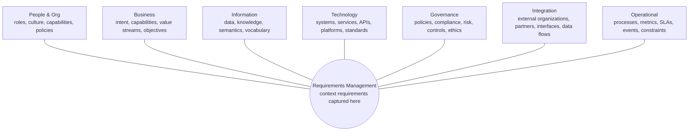

# Enterprise Context Architecture (ECA)

> AI needs authoritative enterprise context.

**Enterprise Context Architecture (ECA)** is a cross-cutting architectural perspective that connects business intent to information, systems, and intelligent outcomes. ECA is a lens that captures the enterprise context every AI capability depends on and makes that context explicit, shared, and traceable.

## Purpose

ECA defines the enterprise contexts required to turn probabilistic AI capabilities into accountable enterprise services. Seven context domains describe the organization in which AI operates and feed context requirements into **Requirements Management** at the centre. Enterprise AI is the primary consumer of ECA: models and agents become trustworthy only when grounded in these contexts.

Enterprises use **systems of record** to support **systems of decision**. Context connects these systems and keeps decisions consistent across models and agents. ECA also documents the **tacit decision frameworks** that previously lived only in people's heads. A clear division of responsibility applies: ECA describes *what is happening* in the enterprise, while enterprise architecture and governance determine *what AI is permitted to do* with it.

## Why ECA

- **Creates shared understanding** across business, architecture, and delivery teams.
- **Maintains consistent meaning** for data, terms, and intent across the enterprise.
- **Supports better decisions** grounded in authoritative context.
- **Aligns architecture with enterprise context** and reduces dependence on isolated solutions.
- **Embeds governance** in architecture and delivery.
- **Reduces AI and solution sprawl** through shared context reuse.

## Context domains

ECA organizes enterprise context into seven domains, all feeding **Requirements Management** at the centre:

1. **People & Org context**, including roles, culture, capabilities, and policies.
2. **Business context**, including intent, capabilities, value streams, objectives, and financial value and cost.
3. **Information context**, including data, knowledge, semantics, and vocabulary, expressed through methods such as knowledge graphs, ontologies, and taxonomies.
4. **Technology context**, including systems, services, APIs, platforms, standards, and application and vendor portfolio lifecycle.
5. **Governance context**, including policies, compliance, risk, controls, ethics, and ownership of authoritative vocabulary and decision boundaries.
6. **Integration context**, including external organizations, partners, interfaces, and data flows.
7. **Operational context**, including processes, metrics, SLAs, events, constraints, and cost of operations.

*Enterprise Context Architecture (ECA) as a cross-cutting perspective across the TOGAF ADM cycle.*

<small>Figure: Enterprise AI Framework · © 2026 Nishant Tamilselvan · [CC BY 4.0](https://creativecommons.org/licenses/by/4.0/)</small>

## Context wheel

!!! note "Reading the wheel"
    The wheel presents a logical view. Domain weight and sequence vary by use case. In
    practice, teams revisit the interdependent domains throughout the work. **Governance
    operates as a continuous layer** across every context and every ADM phase.

## Relationship to TOGAF ADM

ECA provides a cross-cutting perspective at the heart of the TOGAF Architecture Development Method (ADM). It influences every phase of the cycle. See [ECA and the TOGAF ADM](eca-togaf-adm.md) for the per-phase mapping.

## Context ownership and accountability

Making context explicit raises the question of who owns it. Each context domain needs a named owner accountable for its authoritative content, especially the **enterprise vocabulary** and the **decision boundaries** that agents reason from. Governance records who may define, change, and approve context, and who is accountable when an agent acts on it incorrectly. Where practical, domain owners publish authoritative context in **agent-readable formats** so people and AI use the same meaning.

## Right-sizing context

Manage context as a bounded, reusable, versioned asset. Insufficient context forces rework and inconsistent results. Excess context increases token cost and latency without improving outcomes. Reuse reduces repeated architecture work across systems.

## From documentation to runtime

Context delivers value when it moves from architecture documents into the operating workflow. Teams connect authoritative sources, including project and portfolio management information systems (PMIS), catalogs, and policy stores, to the runtime context envelope. This connection traces every AI-assisted decision, claim, approval, and action to the context that governed it.

## Background: what's new and what it builds on

ECA extends established enterprise and business architecture, data governance, and semantics. It treats context as a **first-class, cross-cutting architectural perspective**. AI agents require organizations to make previously tacit context explicit. Accurate, governed, current data and context remain prerequisites for useful results.

## Context envelope

Every AI invocation should operate within an explicit context envelope. As applicable, the envelope contains:

- actor identity, role, authorization, purpose, and delegation chain;
- task, service, case, jurisdiction, time, and channel;
- approved data sources, classification, provenance, and handling rules;
- policy constraints, prohibited actions, and required human decisions;
- model, prompt, retrieval, tool, and configuration versions;
- risk tier, confidence or uncertainty signals, and escalation thresholds;
- output destinations, retention, disclosure, and records obligations; and
- correlation identifiers sufficient for audit and incident investigation.

## Architectural invariants

- AI authority requires explicit delegation and policy.
- Systems re-evaluate identity, authorization, and policy at trust boundaries.
- Systems treat external content as untrusted input.
- Systems treat model output as an assertion and validate it for its intended use.
- Consequential actions remain attributable to an accountable role.
- Organizations retain evidence in proportion to impact, risk, and legal requirements.
- Systems fail safely and preserve a non-AI path where continuity or rights require one.
- Teams version models, prompts, tools, policies, and knowledge sources independently.

## Required architecture decisions

| Decision | Minimum record |
| --- | --- |
| System boundary | Components, actors, dependencies, exclusions |
| Intended use | Authorized users, tasks, contexts, and outcomes |
| Prohibited use | Disallowed users, decisions, data, and actions |
| Risk tier | Method, rationale, approver, reassessment triggers |
| Human oversight | Decision points, competence, time, information, escalation |
| Context sources | Ownership, authority, provenance, freshness, access |
| Model selection | Fitness evidence, constraints, alternatives, exit strategy |
| Tool access | Least privilege, transaction limits, approvals, rollback |
| Evaluation | Metrics, slices, thresholds, independence, acceptance |
| Operations | SLOs, monitoring, incidents, changes, retirement |

## Conformance

A future stable release will define conformance profiles. Until then, adopters should maintain a traceability matrix from mission requirements and risks to architecture decisions, controls, evidence, and accountable approvals.
