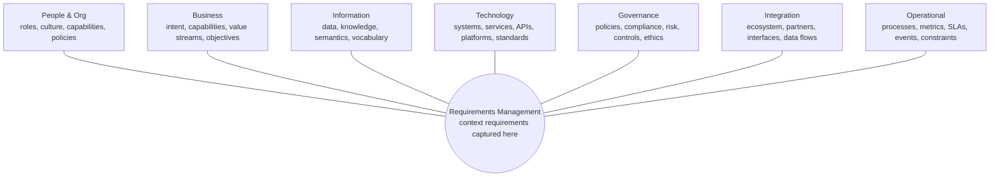

# Enterprise Context Architecture (ECA)

> AI doesn't need more data. It needs the right context.

**Enterprise Context Architecture (ECA)** is a cross-cutting architectural perspective that connects business intent to information, systems, and intelligent outcomes. It is not a new phase or a product; it is a lens that captures the enterprise context every AI capability depends on and makes that context explicit, shared, and traceable.

## Purpose

ECA defines the enterprise contexts required to turn probabilistic AI capabilities into accountable enterprise services. It positions **Requirements Management** at the centre, where context requirements are captured, and surrounds it with seven context domains that together describe the organization AI must operate within. Enterprise AI is the primary consumer of ECA: models and agents become trustworthy only when grounded in these contexts.

As enterprises move from **systems of record to systems of decision**, context becomes the integration layer that keeps decisions consistent across models and agents. ECA also makes explicit the **tacit decision frameworks** that previously lived only in people's heads. A clear division of responsibility applies: ECA describes *what is happening* in the enterprise, while enterprise architecture and governance determine *what AI is permitted to do* with it.

## Why ECA

- **Provides shared understanding** across business, architecture, and delivery teams.
- **Ensures consistent meaning** for data, terms, and intent across the enterprise.
- **Enables better decisions** by grounding them in authoritative context.
- **Aligns architecture with enterprise context** rather than isolated solutions.
- **Drives governance by design** instead of governance as an afterthought.
- **Reduces AI and solution sprawl** by reusing shared context.

## Context domains

ECA organizes enterprise context into seven domains, all feeding **Requirements Management** at the centre:

1. **People & Org context** — roles, culture, capabilities, and policies.
2. **Business context** — intent, capabilities, value streams, objectives, and financial value and cost.
3. **Information context** — data, knowledge, semantics, and vocabulary, expressed through methods such as knowledge graphs, ontologies, and taxonomies.
4. **Technology context** — systems, services, APIs, platforms, standards, and application and vendor portfolio lifecycle.
5. **Governance context** — policies, compliance, risk, controls, ethics, and ownership of authoritative vocabulary and decision boundaries.
6. **Integration context** — ecosystem, partners, interfaces, and data flows.
7. **Operational context** — processes, metrics, SLAs, events, constraints, and cost of operations.

*Enterprise Context Architecture (ECA) as a cross-cutting perspective across the TOGAF ADM cycle.*

## Context wheel

!!! note "Reading the wheel"
    The wheel is a logical view, not a statement of equal weight or sequence. In practice the domains are interdependent and revisited iteratively, and **Governance operates as a continuous layer** across every context and every ADM phase rather than as a single slice.

## Relationship to TOGAF ADM

ECA is deliberately positioned as a cross-cutting perspective at the heart of the TOGAF Architecture Development Method (ADM). It influences every phase of the cycle rather than sitting inside a single phase. See [ECA and the TOGAF ADM](eca-togaf-adm.md) for the per-phase mapping.

## Context ownership and accountability

Making context explicit raises the question of who owns it. Each context domain needs a named owner accountable for its authoritative content — especially the **enterprise vocabulary** and the **decision boundaries** that agents reason from. Governance records who may define, change, and approve context, and who is accountable when an agent acts on it incorrectly. Where practical, authoritative context is published in **agent-readable formats** so the same meaning is available to people and to AI.

## Right-sizing context

Context is an asset to be managed, not maximized. Too little context forces rework and inconsistent results; too much inflates token cost and latency without improving outcomes. Treat context as reusable and versioned so that AI investment compounds rather than being reinvented by each system.

## From documentation to runtime

Context delivers value only when it moves from architecture documents into the operating workflow. Authoritative sources — including systems such as project and portfolio management information systems (PMIS), catalogs, and policy stores — should feed the runtime context envelope so that every AI-assisted decision, claim, approval, and action is traceable back to the context that governed it.

## Background: what's new and what it builds on

ECA is an evolution rather than an invention. It builds on established enterprise and business architecture, data governance, and semantics. What is new is treating context as a **first-class, cross-cutting architectural perspective**, because AI agents are the first systems that require previously tacit context to be made explicit. The persistent constraint remains data and context quality: captured context delivers value only when it is accurate, governed, and current.

## Context envelope

Every AI invocation should operate within an explicit context envelope containing, as applicable:

- actor identity, role, authorization, purpose, and delegation chain;
- task, service, case, jurisdiction, time, and channel;
- approved data sources, classification, provenance, and handling rules;
- policy constraints, prohibited actions, and required human decisions;
- model, prompt, retrieval, tool, and configuration versions;
- risk tier, confidence or uncertainty signals, and escalation thresholds;
- output destinations, retention, disclosure, and records obligations; and
- correlation identifiers sufficient for audit and incident investigation.

## Architectural invariants

- AI does not acquire authority merely because it can perform an action.
- Identity, authorization, and policy are re-evaluated at trust boundaries.
- External content is treated as untrusted input.
- Model output is treated as an assertion until validated for its intended use.
- Consequential actions remain attributable to an accountable role.
- Evidence is retained in proportion to impact, risk, and legal requirements.
- Systems fail safely and preserve a non-AI path where continuity or rights require one.
- Models, prompts, tools, policies, and knowledge sources are independently versioned.

## Required architecture decisions

| Decision | Minimum record |
| --- | --- |
| System boundary | Components, actors, dependencies, exclusions |
| Intended use | Authorized users, tasks, contexts, and outcomes |
| Prohibited use | Disallowed users, decisions, data, and actions |
| Risk tier | Method, rationale, approver, reassessment triggers |
| Human oversight | Decision points, competence, time, information, escalation |
| Context sources | Ownership, authority, provenance, freshness, access |
| Model selection | Fitness evidence, constraints, alternatives, exit strategy |
| Tool access | Least privilege, transaction limits, approvals, rollback |
| Evaluation | Metrics, slices, thresholds, independence, acceptance |
| Operations | SLOs, monitoring, incidents, changes, retirement |

## Conformance

A future stable release will define conformance profiles. Until then, adopters should maintain a traceability matrix from mission requirements and risks to architecture decisions, controls, evidence, and accountable approvals.
