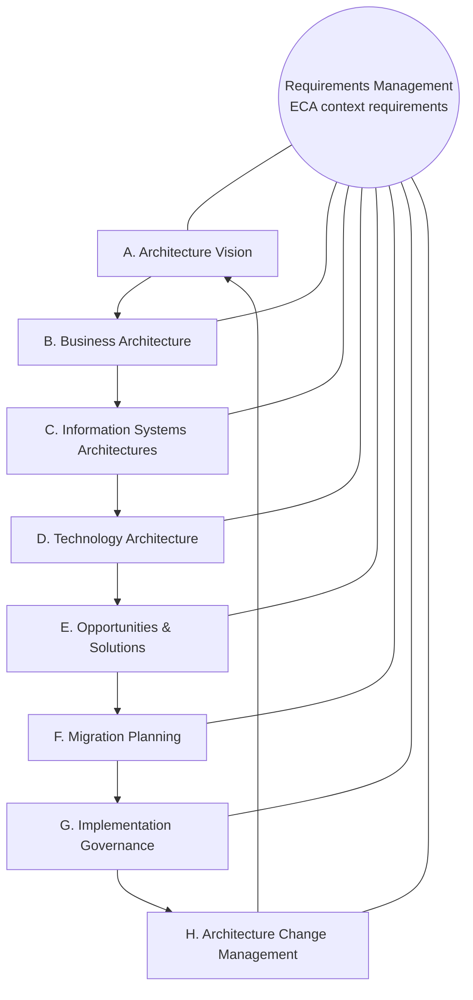

# ECA and the TOGAF ADM

[Enterprise Context Architecture (ECA)](context-architecture.md) provides a cross-cutting
perspective across the TOGAF Architecture Development Method (ADM). ECA preserves the ADM
phase structure and supplies enterprise context to every phase. Requirements Management
captures and updates that context at the center of the cycle.

!!! note "Key change"
    ECA provides a cross-cutting perspective and **influences every phase of the cycle**.
    Requirements Management captures and maintains ECA context requirements for all
    phases.

## ADM cycle

## Phase-by-phase mapping

The table maps each ADM phase to its primary ECA context domains and surfaces the AI
concerns for that phase.

| ADM phase | Primary ECA contexts | AI concerns ECA surfaces |
| --- | --- | --- |
| A. Architecture Vision | Business, People & Org, Governance | Authorized outcomes, decision rights, and prohibited uses before work begins |
| B. Business Architecture | Business, People & Org, Operational | Intent, value streams, capabilities, and roles AI would support or change |
| C. Information Systems Architectures | Information, Technology, Integration | Data, semantics, applications, and interfaces AI would depend on or disrupt |
| D. Technology Architecture | Technology, Integration, Operational | Platforms, model gateways, grounding sources, and infrastructure boundaries |
| E. Opportunities & Solutions | Business, Technology, Governance | Buy/build/reuse choices, model and platform options, and sprawl reduction |
| F. Migration Planning | Operational, Governance, People & Org | Rollout risk, workforce impact, oversight readiness, and control sequencing |
| G. Implementation Governance | Technology, Integration, Governance, Operational | Least-privilege tool access, evaluation gates, and control evidence at build time |
| H. Architecture Change Management | Governance, Business, People & Org | Drift, material-change assessment, re-approval, and context fed back to Requirements Management |

## Requirements Management at the center

Requirements Management links ECA to the ADM. Each phase reads ECA context requirements
and writes back new or changed requirements as the architecture evolves. This exchange
keeps mission intent, data semantics, governance obligations, and operational constraints
synchronized across the cycle. AI capabilities remain grounded in current, authoritative
enterprise context.

## Alignment note

This page uses the canonical TOGAF ADM phase names (A. Architecture Vision through
H. Architecture Change Management, with Requirements Management at the center). The
mapping supports adoption and carries no endorsement or certification from The Open Group.
Validate ADM tailoring against your organization's architecture practice.
