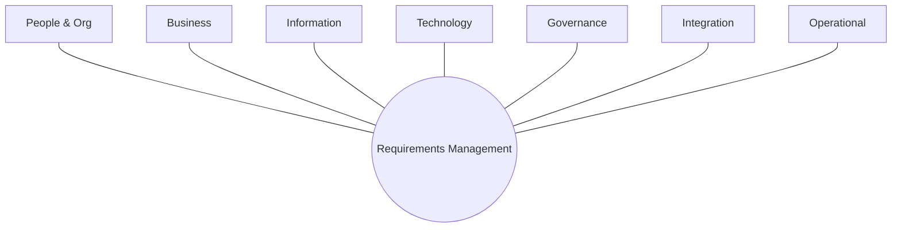
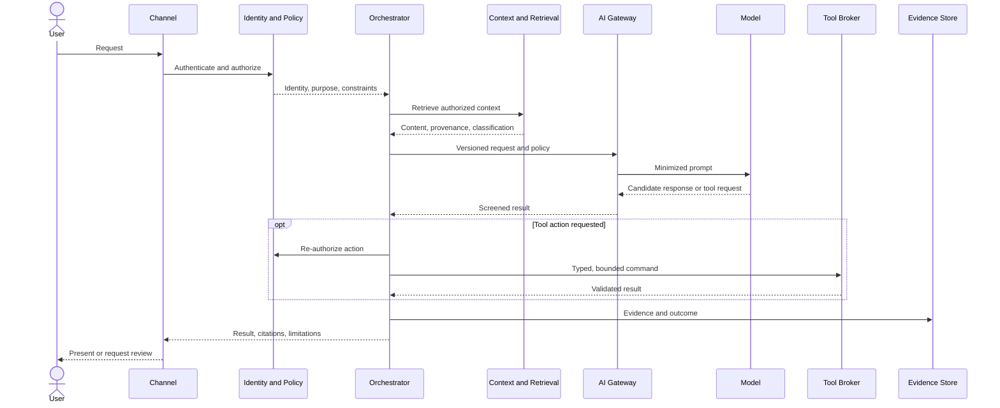

# Reference diagrams

Reference diagrams communicate logical responsibilities and trust boundaries. Product selection remains outside their scope.

## Enterprise Context Architecture wheel

Requirements Management captures context requirements at the center of seven ECA context domains.

## Controlled AI service flow

## Diagram contribution rules

Store editable sources in `docs/assets/diagrams/`, export accessible SVG where practical, avoid vendor logos in logical views, label trust boundaries, and include a text explanation for every published diagram.
