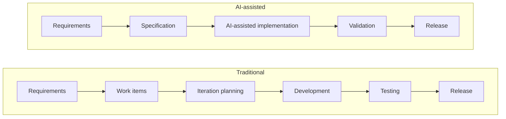

# AI-assisted delivery overview

AI-assisted delivery changes *how* teams produce software, not only how fast. When AI
generates much of the implementation, the scarce resource shifts from writing code to
defining intent, validating outcomes, and governing quality. This section describes an
operating model for AI-assisted delivery that preserves accountability and reconciles with
the governance [lifecycle gates](../governance/operating-model.md).

The model is principle-based and vendor-neutral. It does not prescribe a specific agile
method, tool, or team size; it describes where effort, artefacts, and accountability move
when AI does a large share of the implementation.

![The shift to AI-assisted delivery: the strategic focus moves from writing code, creating work items, manual testing, iteration administration, and implementation effort toward specification ownership and validation, detailed specifications, automated verification and evaluation, delivery coordination and governance, and quality, review, and accountability. The delivery pipeline compresses from requirements, work items, iteration planning, development, testing, release to requirements, specification, AI-assisted implementation, validation, release. Implementation becomes validation of the specification, not discovery of requirements, and human review and governance concentrate on the specification and validation stages.](../assets/images/delivery-shift.webp)

## What changes

Traditional delivery is organised around producing code and managing work items.
AI-assisted delivery is increasingly organised around producing specifications, validating
outcomes, enforcing standards, and governing delivery.

| Traditional focus | AI-assisted focus |
| --- | --- |
| Writing code | Specification ownership and validation |
| Creating work items | Creating detailed specifications |
| Manual testing | Automated verification and evaluation |
| Iteration administration | Delivery coordination and governance |
| Implementation effort | Quality, review, and accountability |

The single most important shift is the artefact: the **specification** becomes the primary
deliverable, and implementation becomes *validation of the specification* rather than
*discovery of requirements during implementation*.

## Delivery pipeline shift

The delivery sequence compresses. Work-item decomposition and iteration planning are
replaced by specification engineering and AI-assisted implementation.

The removed stages are coordination overhead; the retained stages — specification and
validation — are where human judgement and governance now concentrate.

## Scope and exclusions

This section covers:

- The specification as the authoritative delivery artefact.
- How roles and accountability shift when AI generates implementation.
- How to size and structure teams, and how to decompose work.

It does not replace governance, security, or architecture guidance. Risk classification,
authorization, threat modelling, and enterprise architecture remain governed by their
respective sections; this section describes how delivery *operates within* them.

## How this section is organised

- [Specification-driven delivery](specification-driven-delivery.md) — the specification as
  the authoritative artefact, its anatomy, handoffs, and traceability.
- [Roles and accountability](roles-and-accountability.md) — how roles shift and who is
  accountable for each outcome and gate.
- [Team topologies](team-topologies.md) — sizing, why more developers can slow delivery,
  short delivery loops, and work decomposition.

## Relationship to the rest of the framework

The delivery model is the team-level expression of the governance
[operating model](../governance/operating-model.md): its handoffs map to the lifecycle
gates, and its accountable roles map to the named accountability owners. It exercises the
[capability model](../architecture/capability-model.md) — particularly AI engineering,
platform and integration, and people and adoption — and depends on well-formed
[context](../architecture/context-architecture.md) to specify systems correctly.
