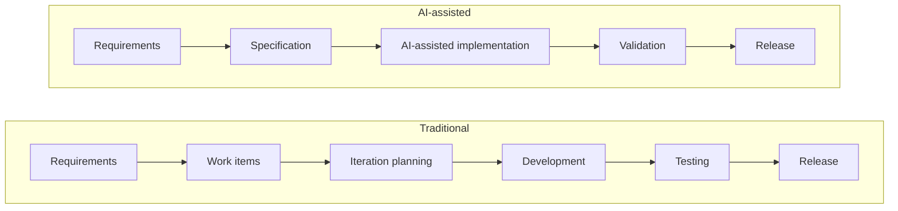

# AI-assisted delivery overview

AI-assisted delivery changes how teams produce software and allocate effort. When AI
generates much of the implementation, teams spend more time defining intent, validating
outcomes, and governing quality. This section describes an operating model that preserves
accountability and aligns with the governance
[lifecycle gates](../governance/operating-model.md).

The model is principle-based and vendor-neutral. It applies across agile methods, tools,
and team sizes. It describes how teams allocate effort, manage artifacts, and assign
accountability when AI performs a large share of the implementation.

![The shift to AI-assisted delivery. Traditional delivery emphasizes writing code, creating work items, manual testing, iteration administration, and implementation effort. AI-assisted delivery emphasizes specification ownership, detailed specifications, automated evaluation, delivery governance, quality, and accountability. The traditional pipeline includes requirements, work items, iteration planning, development, testing, and release. The AI-assisted pipeline includes requirements, specification, AI-assisted implementation, validation, and release. Human review and governance concentrate on specification and validation.](../assets/images/delivery-shift.webp)

<small>Figure: generated with NotebookLM from the framework's text · Enterprise AI Framework · [CC BY 4.0](https://creativecommons.org/licenses/by/4.0/)</small>

## What changes

Teams organize traditional delivery around producing code and managing work items. Teams
organize AI-assisted delivery around producing specifications, validating outcomes,
enforcing standards, and governing delivery.

| Traditional focus | AI-assisted focus |
| --- | --- |
| Writing code | Specification ownership and validation |
| Creating work items | Creating detailed specifications |
| Manual testing | Automated verification and evaluation |
| Iteration administration | Delivery coordination and governance |
| Implementation effort | Quality, review, and accountability |

The **specification** becomes the primary deliverable. Teams complete requirements
discovery before implementation and use implementation to validate the specification.

## Delivery pipeline shift

The delivery sequence compresses. Specification engineering and AI-assisted implementation
replace work-item decomposition and iteration planning.

The removed stages represent coordination overhead. Human judgment and governance
concentrate on the retained specification and validation stages.

## Scope and exclusions

This section covers:

- The specification as the authoritative delivery artifact.
- How roles and accountability shift when AI generates implementation.
- How to size and structure teams, and how to decompose work.

The governance, security, and architecture sections retain authority over risk
classification, authorization, threat modeling, and enterprise architecture. This section
describes how delivery operates within those requirements.

## Section contents

- [Specification-driven delivery](specification-driven-delivery.md): the specification as
  the authoritative artifact, its anatomy, handoffs, and traceability.
- [Roles and accountability](roles-and-accountability.md): how roles shift and who is
  accountable for each outcome and gate.
- [Team topologies](team-topologies.md): sizing, why more developers can slow delivery,
  short delivery loops, and work decomposition.

## Relationship to the rest of the framework

The delivery model applies the governance
[operating model](../governance/operating-model.md) at team level. Its handoffs map to the
lifecycle gates, and its accountable roles map to the named accountability owners. It
exercises the [capability model](../architecture/capability-model.md), including AI
engineering, platform and integration, and people and adoption. It also depends on
well-formed [context](../architecture/context-architecture.md) to specify systems correctly.
