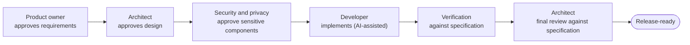

# Specification-driven delivery

In AI-assisted delivery, the **specification** is the authoritative artifact. Teams derive
work items from it. Work items describe fragments of intent that teams assemble over
successive iterations. A specification captures the full intent before implementation in
enough detail for an AI-assisted team to implement and validate directly.

<small>Figure: generated with NotebookLM from the framework's text · Enterprise AI Framework · [CC BY 4.0](https://creativecommons.org/licenses/by/4.0/)</small>

## Specifications and work items

| Dimension | Work-item-driven | Specification-driven |
| --- | --- | --- |
| Unit of truth | Many small work items and acceptance criteria | One versioned specification |
| Where requirements are discovered | During implementation, through refinement | Up front, during specification engineering |
| Primary effort | Writing and coordinating code | Writing and validating the specification |
| Role of implementation | Discovery of requirements | Validation of the specification |
| Refinement overhead | High (grooming, decomposition, estimation) | Low (specification review replaces grooming) |
| Historical record | Work items plus external documents | Specification committed with the code |
| Auditability | Scattered across tools | Versioned alongside the codebase |

Teams may slice a specification into small work items for parallel delivery. The
**specification remains authoritative**, and teams derive each work item from it.

## Anatomy of a specification

A specification is authoritative only if it is complete enough to implement against without
re-discovering intent. Each specification should contain:

1. **Purpose and context**: the problem, the affected users, and the intended outcome.
2. **Requirements**: functional and non-functional, stated testably.
3. **Acceptance criteria**: the conditions that define done, written so verification can
   confirm them directly.
4. **Architecture constraints**: patterns, boundaries, and integration points the
   implementation must respect.
5. **Security and privacy requirements**: data classification, access, and threat
   considerations for sensitive components.
6. **Standards references**: the organizational standards, patterns, and reusable
   templates that govern the solution.
7. **Open questions and resolutions**: a running log of ambiguities and how the team
   resolved them.
8. **Approvals**: a record of who approved requirements, design, and security, and when.

Treat this as a reusable checklist. Complete every element before implementation.

## The specification-based handoff chain

Specification approvals define the handoffs. Each transition is an approval point where
human judgment adds quality. AI throughput makes review the limiting factor.

This chain applies the governance [lifecycle gates](../governance/operating-model.md) at
team level. Requirement and design approval align
to **Assessment** and **Design**; developer and verification work align to **Build and
validate**; the final review feeds **Authorize and release**. The named accountability
owners remain accountable at each gate.

## The specification as historical record

Because the specification is authoritative, it lives where the solution lives:

- **Commit specifications into the repository** alongside the code they describe.
- **Record architecture decisions** in the specification, or in linked decision records, so
  the rationale survives.
- **Capture business clarifications** in the specification's open-questions log.
- **Version approvals with the codebase**, so any release can show who approved what.

This approach stores audit and maintenance history in one versioned place tied to the code.

## Guardrails

- Validate the **specification's testability** before implementation begins. A flawed
   specification can produce an implementation that passes its own tests.
- Keep a **named human accountable** for every AI-generated artifact through to production.
- Apply **separation of duties** by requiring a second human to approve each AI-assisted
   change.
