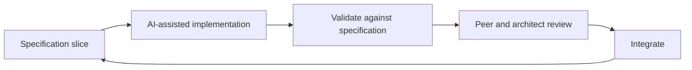

# Team topologies for AI-assisted delivery

Traditional teams assume that more developers means more delivery capacity: work is
distributed through work items and iteration planning, and collaboration happens through
ceremonies. AI weakens that assumption. When a single contributor can generate large
volumes of working code quickly, the constraint is no longer how fast code is written — it
is how fast specifications are clarified, changes are validated, and outcomes are reviewed.
Sizing a team by developer headcount optimises a resource that is no longer scarce.

The resolution is not single-person teams. It is a **small, cross-functional team weighted
toward specification, validation, and governance**, running in short loops.

![Right-sizing the AI-assisted team (illustrative): a traditional team of about nine full-time roles — architect, roughly three developers, about one QA, product owner, scrum master, business analyst or service designer, and a UI/UX designer — inverts to a smaller AI-assisted core of about 3.75 — a full-time architect and developer, with fractional QA, product owner, service designer, and delivery coordinator, plus security and privacy review, operational ownership, and UI/UX design engaged on demand. The architect stays full-time with focus shifting to specification engineering, while developer and QA headcount fall and UI/UX becomes on-demand.](../assets/images/delivery-team-topologies.webp)

## Size by specification weight, not headcount

Weight the team toward the roles that now carry the work — specification, verification, and
coordination — and keep implementation headcount small, because AI performs most generation
and humans direct and verify it.

!!! note "Illustrative only"
    The figures below are an example to show the *shape* of a specification-weighted team,
    not a prescribed team size. Tailor them to mission, risk, and scale.

An indicative allocation for a single AI-assisted product team:

| Role | Indicative FTE | Why |
| --- | --- | --- |
| Architect / specification engineer | 1.0 | Owns the specification — the primary deliverable, amplified by AI tools |
| Developer | 1.0 | Directs and validates AI-generated implementation |
| Verification specialist | 0.5 | Verification and evaluation against the specification |
| Product owner | 0.5 | Requirement clarification and business approval |
| Service designer | 0.5 | User and service journey inputs to the specification |
| Delivery coordinator | 0.25 | Flow, dependencies, and governance checkpoints |
| **Core total** | **3.75** | |
| Security and privacy reviewer | on demand | Risk-triaged specification review |
| Operational owner | on demand | Live-solution accountability |
| Interaction (UI/UX) designer | on demand | Engaged for complex or accessibility-critical work |

Compared with a traditional team for equivalent scope, the allocation **inverts**:

| Role | Traditional FTE | AI-assisted FTE |
| --- | --- | --- |
| Architect | 1.0 | 1.0 |
| Developers | ~3.0 | 1.0 |
| Verification | ~1.0 | 0.5 |
| Product owner | 1.0 | 0.5 |
| Delivery coordinator | 1.0 | 0.25 |
| Business analyst / service designer | 1.0 | 0.5 |
| Interaction (UI/UX) designer | 1.0 | on demand |
| **Total** | **~9.0** | **3.75** |

The architect stays full-time, but the focus shifts from design and developer guidance to
specification engineering; developer and verification headcount fall because AI generates and
humans direct and verify. Interaction design shifts to on-demand consultation, with AI
generating interface scaffolding from the specification.

The principle: fewer, more senior people weighted toward specification outperform a large
team weighted toward implementation.

## Why adding developers can slow delivery

The instinct to add developers to go faster tends to backfire in an AI-assisted team:

- **The bottleneck has moved.** Code generation is no longer the constraint; specification
  clarity, review, and integration are. Adding developers floods the actual constraint —
  review and integration capacity — lengthening the queue rather than shortening delivery.
- **AI output resists clean partition.** Detailed specifications produce large,
  interconnected implementations. Splitting them across developers creates merge conflicts,
  divergent context, and rework at the seams.
- **Coordination cost is superlinear.** Communication paths grow roughly as *n(n−1)/2*; each
  added developer adds handoffs, context synchronisation, and review load.
- **Review concentrates on one role.** The architect reviews against the specification;
  more developers generate more to review against a fixed review capacity.

Better levers than headcount: invest in specification quality, keep implementation headcount
small, run short loops, and scale horizontally with multiple small teams rather than adding
developers to one solution.

## Short delivery loops

Throughput comes from loop speed and size, not team size. Each loop takes a small slice of
the specification through to integrated, validated code:

Practices that keep loops short:

- **Small atomic changes** — small commits and frequent, reviewable pull requests.
- **Low work-in-progress** — finish and integrate a slice before starting the next.
- **Continuous validation** — validate each slice against the specification as it lands,
  not at a fixed iteration boundary.

## Work decomposition and swim lanes

When more than one contributor is genuinely needed, partition the **specification** into
bounded areas of responsibility — swim lanes — with minimal coupling, rather than splitting
a single interconnected implementation:

- **Bounded ownership.** Each swim lane is owned end-to-end by one contributor, reducing
  overlap and merge conflict.
- **Small slices.** Each lane's work should fit the short-loop rhythm above.
- **Light coordination.** Synchronise lanes through periodic structured checkpoints —
  dependency and integration coordination, not detailed task management.
- **Scale by teams, not by developers.** Growth comes from adding small swim-lane teams,
  each with its own specification, rather than adding developers to one solution.
