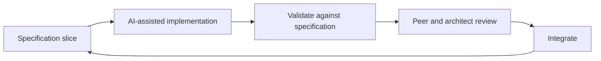

# Team topologies for AI-assisted delivery

Traditional teams often use developer headcount as a measure of delivery capacity. They
distribute work through work items, iteration planning, and delivery ceremonies. AI changes
that relationship. When a single contributor can generate large volumes of working code,
specification clarity, validation capacity, and outcome review determine throughput.
Developer headcount becomes a poor sizing measure because code generation is abundant.

A **small, cross-functional team weighted toward specification, validation, and governance**
provides the required collaboration and runs in short loops.

![Illustrative comparison of traditional and AI-assisted team allocation. A traditional team uses about nine full-time roles across architecture, development, verification, product ownership, delivery coordination, service design, and interaction design. An AI-assisted core uses about 3.75 full-time equivalents: one architect, one developer, and fractional verification, product ownership, service design, and delivery coordination. Security and privacy review, operational ownership, and interaction design engage on demand. The architect remains full-time and focuses on specification engineering. Developer and verification allocations decrease.](../assets/images/delivery-team-topologies.webp)

<small>Figure: generated with NotebookLM from the framework's text, with one word corrected by hand · Enterprise AI Framework · [CC BY 4.0](https://creativecommons.org/licenses/by/4.0/)</small>

## Size teams by specification workload

Weight the team toward specification, verification, and coordination roles. Keep
implementation headcount small because AI performs most generation while people direct and
verify it.

!!! note "Illustrative only"
    The figures below illustrate the structure of a specification-weighted team. Tailor the
    allocation to mission, risk, and scale.

An indicative allocation for a single AI-assisted product team:

| Role | Indicative FTE | Why |
| --- | --- | --- |
| Architect / specification engineer | 1.0 | Owns the specification as the primary deliverable and uses AI tools to support the work |
| Developer | 1.0 | Directs and validates AI-generated implementation |
| Verification specialist | 0.5 | Verification and evaluation against the specification |
| Product owner | 0.5 | Requirement clarification and business approval |
| Service designer | 0.5 | User and service design inputs to the specification |
| Delivery coordinator | 0.25 | Flow, dependencies, and governance checkpoints |
| **Core total** | **3.75** | |
| Security and privacy reviewer | on demand | Risk-triaged specification review |
| Operational owner | on demand | Live-solution accountability |
| Interaction (UI/UX) designer | on demand | Engaged for complex or accessibility-critical work |

For equivalent scope, AI assistance changes the allocation:

| Role | Traditional FTE | AI-assisted FTE |
| --- | --- | --- |
| Architect | 1.0 | 1.0 |
| Developers | ~3.0 | 1.0 |
| Verification | ~1.0 | 0.5 |
| Product owner | 1.0 | 0.5 |
| Delivery coordinator | 1.0 | 0.25 |
| Business analyst / service designer | 1.0 | 0.5 |
| Interaction (UI/UX) designer | 1.0 | on demand |
| **Total** | **~9.0** | **3.75** |

The architect remains full-time and focuses on specification engineering. Developer and
verification allocations decrease because AI generates implementation while people direct
and verify it. Interaction designers work on demand, and AI generates interface scaffolding
from the specification.

A small senior team weighted toward specification can outperform a large team weighted
toward implementation.

## Why adding developers can slow delivery

Adding developers often slows an AI-assisted team for four reasons:

- **Specification and review set the pace.** Additional developers increase demand on fixed
  review and integration capacity, which lengthens the queue.
- **Large implementations are difficult to partition.** Detailed specifications can produce
  interconnected implementations. Splitting them across developers creates merge conflicts,
  divergent context, and integration rework.
- **Coordination cost is superlinear.** Communication paths grow roughly as *n(n−1)/2*; each
  added developer adds handoffs, context synchronization, and review load.
- **Review concentrates on one role.** The architect reviews against the specification;
  more developers generate more to review against a fixed review capacity.

Improve throughput by investing in specification quality, keeping implementation headcount
small, running short loops, and assigning separate solutions to multiple small teams.

## Short delivery loops

Loop speed and slice size determine throughput. Each loop takes a small part of the
specification through to integrated, validated code:

Practices that keep loops short:

- **Small atomic changes.** Use small commits and frequent, reviewable pull requests.
- **Low work-in-progress.** Finish and integrate a slice before starting the next.
- **Continuous validation.** Validate each slice against the specification as it lands.

## Work decomposition and swim lanes

When work requires multiple contributors, partition the **specification** into bounded areas
of responsibility called swim lanes. This structure minimizes coupling across a single
interconnected implementation.

- **Bounded ownership.** Assign each swim lane to one contributor from start to finish. This
  assignment reduces overlap and merge conflicts.
- **Small slices.** Each lane's work should fit the short-loop rhythm above.
- **Light coordination.** Synchronize lanes through periodic checkpoints for dependency and
  integration coordination.
- **Team-based scaling.** Add small swim-lane teams, each with its own specification and
  solution boundary.
